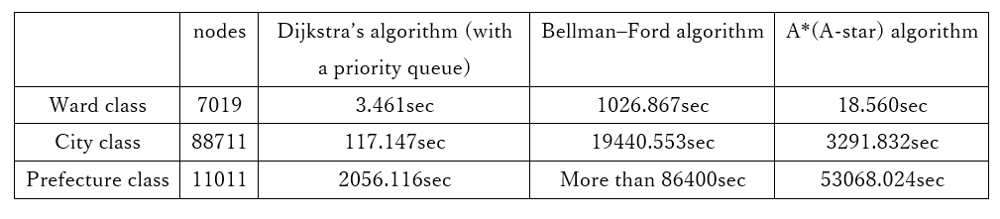

# Emergency_Route_Planner
## Overview
This project is developed as an algorithm assignment in August 2025.
Given a specified point on a map, the system identifies the nearest fire station and the nearest emergency medical hospital capable of handling critical patients. It computes and visualizes the shortest route between these locations along with the estimated travel time.
Due to the high computational cost of map rendering, the implementation is limited to a specific area in Kanagawa Prefecture.
The system is built using Google Colaboratory and OSMnx (https://github.com/gboeing/osmnx), a Python library for working with geospatial data from OpenStreetMap (OSM), a collaborative, crowd-sourced geographic information platform.
The following three shortest-path algorithms are implemented and compared:
1. Dijkstra’s algorithm (with a priority queue) 
2. Bellman–Ford algorithm
3. A* (A-star) algorithm

##Code Flow
① Import required libraries and dependencies  
② Implement a function to convert an address into latitude and longitude  
② Accept user input  
④ Retrieve the map data and nodes  
⑤ Acquire fire station data  
⑥ Load hospital data from a CSV file  
⑦ Convert the map graph adjacency relationships into a dictionary  
⑧ Dijkstra’s algorithm  
⑨ Bellman–Ford algorithm  
⑩ A* heuristic algorithm  
⑪ Main process for shortest-path computation  
⑫ Calculate distance and estimated transportation time  
⑬ Output route information and execution time  
⑭ Plot routes and locations on the map

## Example Output(ward class)

  

##Result

  

  

