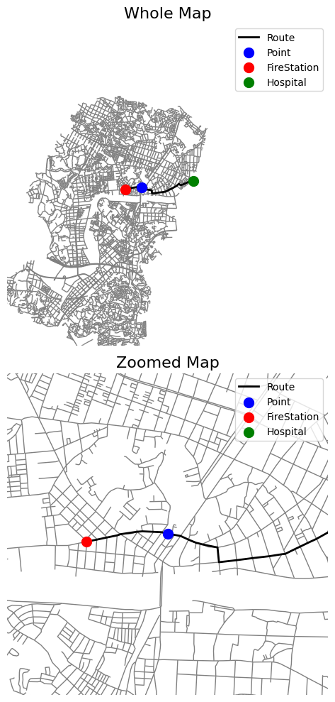
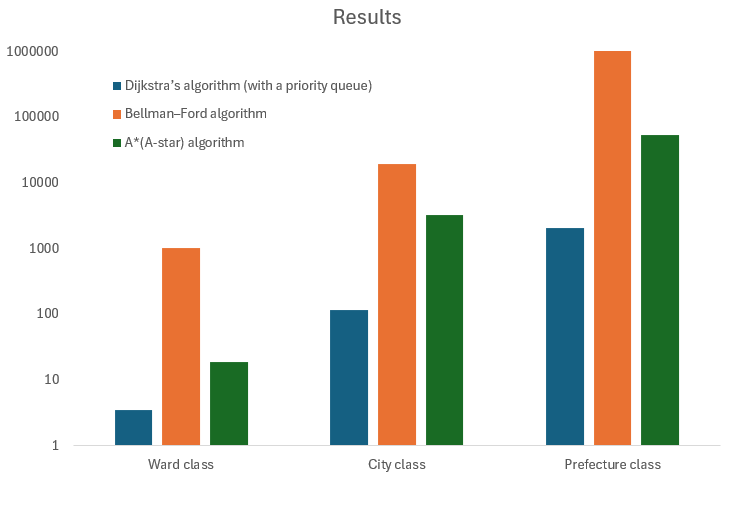

# Emergency_Route_Planner
## 1. 概要
このシステムは2025年6月の最短経路探索のアルゴリズム課題から着想を得て2025年7月につくられました。地図上の指定された地点に対し、最も近い消防署と救急対応可能な病院を特定し、それらの地点間の最短経路と推定所要時間を3つのアルゴリズムで計算・可視化します。実装時の想定地域は神奈川県横浜市・川崎市全域としています。主にGoogle Colaboratoryで実装し、オープンストリートマップ（OSM）の地理空間データを扱うPythonライブラリであるOSMnx (https://github.com/gboeing/osmnx) を使用して構築されています。以下の3つの最短経路アルゴリズムを実装し、比較を行いました。
・ダイクストラ法（優先度付きキュー）
・ベルマンフォード法
・A＊(Aスター)法
消防署の位置はOSM Features APIから参照していますが、病院については同様にするとクリニックや歯科医院等が最寄と判定され、機能性を損ねたため、信頼できるサイトから自前で救急対応可能な病院とその住所をCSVにまとめ参照することで解決しました。故に、実装時の想定地域が限定的であるのは、経路探索アルゴリズムやライブラリの問題ではなく、病院のCSｖによるものです。

## 2. 初期実装
### 2.1 初期実装のコードフロー
① 必要なライブラリと依存関係のインポート 
② 住所を緯度・経度に変換する機能の実装 
③ ユーザー入力の受け付け 
④ 地図データとノードの取得 
⑤ 消防署データの取得 
⑥ CSVファイルからの病院データの読み込み 
⑦ 地図グラフの隣接関係を辞書形式へ変換 
⑧ ダイクストラ法の実装 
⑨ ベルマンフォード法の実装 
⑩ A＊の実装 
⑪ 最短経路計算のメイン処理 
⑫ 距離と推定移動時間の計算 
⑬ 経路情報と実行時間の出力 
⑭ 地図上への経路と位置のプロット

### 2.2 初期実装版の結果
出力例(ward class)

  

結果

  

  

よって、探索範囲に関わらず、計算時間は、ベルマンフォード法、A＊法、ダイキストラ法の順に速くなっていました。ベルマンフォード法の実行に時間がかかるのは計算量に応じたものであると言えます。ただ、A*法はダイクストラ法と最悪計算量が同じで、平均計算量は小さいはずのため、予想を裏切る結果となりました。

## 3. 改善版
### 3.1 改善版における変更点と機能強化
初期実装における計算コストの疑問点に基づき、コードを見直し、計算コストの削減・ユーザー体験の向上・検証観点の追加のため、以下の改善を行いました。
①各アルゴリズムの計算フローの見直し
・ダイクストラ法・ベルマンフォード法:
  改善前: 全ての消防署に対してループを回し、各消防署から個別に探索を行っていました。
  改善後: 通報地点を始点として1回だけ計算を行い、グラフ上の全ノードへの最短距離を確定させる1対多のアプローチに変更しました。
・A＊法:
  改善前: 病院と消防署の組み合わせの二重ループとなっており、例えば、通報地点から病院までの経路は消防署の位置と無関係であるのに計算に含めていました。
  改善後: 通報地点から最寄りの病院・消防署への探索を独立させる構造に変更しました。
②アルゴリズム比較機能の強化
・時間制限の導入: 探索処理に時間制限を設け、制限時間内に計算が完了しなかった場合でも、その時点までに到達した「最もゴールに近い地点」までの経路を暫定的に出力する機能を追加しました。これにより、計算量が膨大なベルマンフォード法と、探索効率の良いA*法の挙動の違いをより明確に比較できるようににしました。
・並列実行と結果の表形式出力: 3つのアルゴリズムを同一条件下で実行し、計算時間、総距離、到達状態をPandas DataFrameを用いて一覧表示するようにしました。
③地図データ処理の効率化とロバスト性の向上
・動的なBoundingBoxの取得: 横浜・川崎全域などのデータをロードするのではなく、通報地点・消防署・病院の3点が含まれる最小限の範囲を動的に計算してデータを取得するように変更しました。これにより、メモリ使用量を抑えつつ、必要なデータを確実に取得できるようになりました。

### 3.2 結果
以下は出力結果です。
設定
通報地点 (例: Kawasaki Station, Kanagawa, Japan): 生田キャンパス
通報地点: 明治大学 生田キャンパス, 1, 東三田一丁目, 多摩区, 川崎市, 神奈川県, 214-8571, 日本
探索制限時間[秒] (例: 1.0): 0.5

最寄りの施設座標を計算中...
最寄り病院特定: 横浜総合病院 (直線距離 5141m)
最寄りの消防署を検索中...
最寄り消防署特定: 川崎市消防局多摩消防署 (直線距離 963m)

地図データをダウンロード中 (半径5km)...
グラフ準備完了: 16564 nodes

経路探索開始 (制限時間: 0.5秒/区間)...

探索結果一覧 (最寄り病院: 横浜総合病院)
| Algorithm    | Status         |   Fire->Point (m) |   Point->Hosp (m) |   Total Dist (m) |   Est Time (min) |   Comp Time (sec) |
|:-------------|:---------------|------------------:|------------------:|-----------------:|-----------------:|------------------:|
| Dijkstra     | Complete       |              1306 |              6618 |             7925 |             16.9 |            0.2438 |
| A*           | Complete       |              1306 |              6618 |             7925 |             16.9 |            0.054  |
| Bellman-Ford | Timeout (Both) |               839 |                 0 |              839 |              6.3 |            0.1367 |

出力例

  

よって、改善によって、A*法、ダイキストラ法、ベルマンフォード法の順に実行に時間がかかることが分かり、理論通りの結果が得られた。

ただ、ベルマンフォード法は負の重みも考慮して実装できる点等で、有効活用されているようであり、一概に計算量が大きいからと言って役立たないわけではないと言える。

